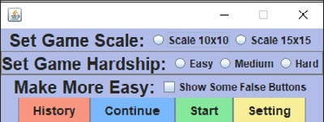
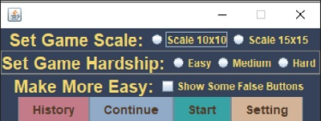
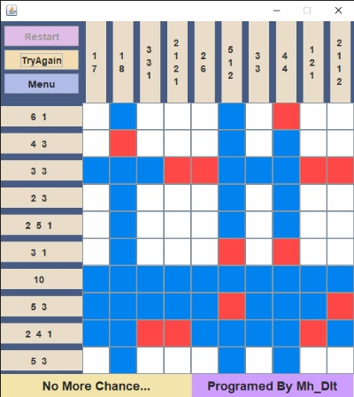
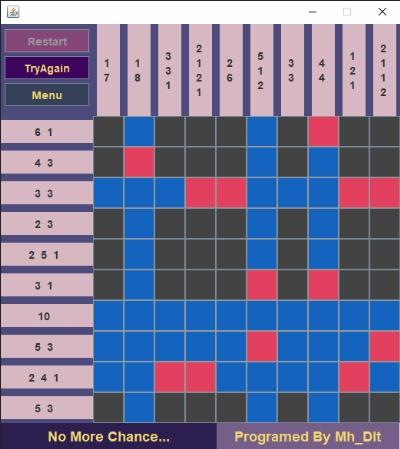
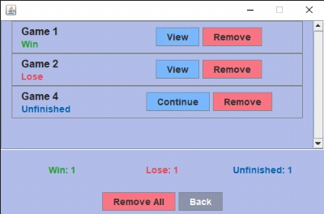
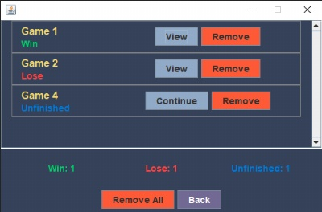
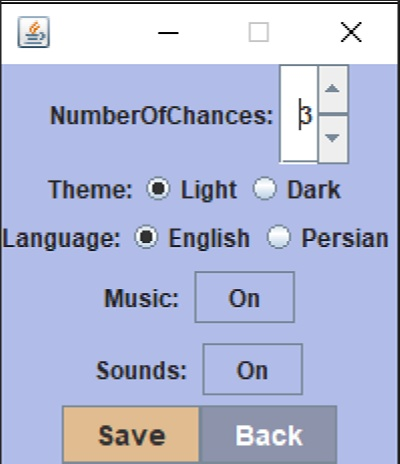
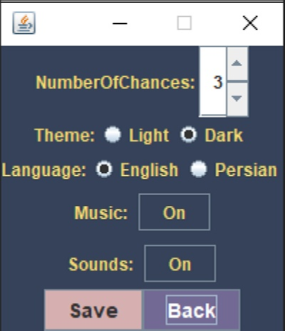

# Nonogram Java Version

Java gui puzzle game as a sample project with java

This project is pure java and no framework or library is used


## Main Goal
The main goal of the project was to strengthen object orientation, and the use of files and media such as sound
# About important parts of the project
## How does the content of the game page change?
The whole project is a Jframe and its content is changed with the reload method in the MainFrame class

And this method is called in the button function of each page
```java
    public class MainFrame extends JFrame {

        // Other Codes

            public static void reload(JFrame frame, JPanel panel){
                frame.getContentPane().removeAll();
                frame.add(panel);
                frame.pack();
                frame.setLocationRelativeTo(null);
                frame.getContentPane().validate();
            }
    }
```
The main reason we use this method to reload MainFrame is that the methods used in reload
they are not static and we cannot use them directly outside the class without instantiating MainFrame

So we have to pass the MainFrame to reload as function input frame
## The function of program control buttons is determined outside the class that is defined (in mainWindow class). Why?
Because the game control button maybe reload the mainFrame and take data from other places, the function of the buttons must be determined outside the class in which they are defined, and for this the buttons must be static.

Because normally we can't access the information outside the class in which the buttons are defined and defining the buttons function

```java
    public class MainFrame extends JFrame {


        // Other Codes


            public MainFrame(){

                // Other Codes
                
                Menu.start.addActionListener(e -> MenuButtonsActionListener.start(this));
                Menu.settings.addActionListener(e -> MenuButtonsActionListener.setting(this));
                Menu.continueGame.addActionListener(e -> MenuButtonsActionListener.continueGame(this));
                Menu.gameHistory.addActionListener(e -> MenuButtonsActionListener.history(this));

                GamePad.restart.addActionListener(e -> GamePadButtonsActionListener.restart(this));
                GamePad.tryAgain.addActionListener(e -> GamePadButtonsActionListener.tryAgain(this));
                GamePad.menu.addActionListener(e -> GamePadButtonsActionListener.menu(this));

                HistoryList.removeAll.addActionListener(e -> HistoryButtonsActionListener.removeAll(this));
                HistoryList.back.addActionListener(e -> PublicActionListener.menu(this));

                Settings.back.addActionListener(e -> PublicActionListener.menu(this));
                Settings.save.addActionListener(e -> SettingsButtonsActionListener.saveData(this));
                Settings.musicOnOff.addActionListener(e -> SettingsButtonsActionListener.MusicSoundsControl(Settings.musicOnOff));
                Settings.soundsOnOff.addActionListener(e -> SettingsButtonsActionListener.MusicSoundsControl(Settings.soundsOnOff));
            
                // Other Codes

            }

                // Other Codes
    }
```

But the functions of the two buttons located in GameHistory loadGame and remove , are determined directly inside the class because they only have access to the folder of one game

This is how mainWindow reaches loadGame and remove buttons in GameHistory:

- history button load HistoryList class and give it mainWindow
- HistoryList during making each item (each item is instance of GameHistory) gives mainWindow to the item (GameHistory)
- And finally, the main window is given to the loadgame and remove buttons function
## How does GamesFoldersManager calss work?
Explanation about addresses and methods of the GamesFoldersManager class.
### Structure of addresses
- The main folder that includes the folder of all games
```java
    public static final File GamesDataFolder = new File("GameData") ;
```
- The prefix of the name of the games folder, to which the game number will be added later
```java
    private static final String prefix = "/Game ";
```
- Games folder: Their name consists of prefix and game number
```java
    public static File GameFolder;
```
- Game files: Their address depends on GameFolder
```java
    public static File GameConfig;
    public static File FalsePoints;
    public static File ShowingFalseButtons;
    public static File WrongClicked;
    public static File CorrectClicked;
```
- folderList: A list that has the folder address of all games that sorted by name.

The sortFolders method returns this list and stored in folderList
```java
    public static ArrayList<File> folderList = (Files.exists(GamesDataFolder.toPath()) && GamesDataFolder.list().length != 0 )? sortFolders() : new ArrayList<>();
```
### Sorting Methods
- sortFolders Method: Sort game folders by the number of their name
```java
    private static ArrayList<File> sortFolders(){
        ArrayList<Integer> indexList = new ArrayList<>();
        for (String dirName : GamesDataFolder.list()) indexList.add(Integer.parseInt(dirName.split(" ")[1]));
        Collections.sort(indexList);
        ArrayList<File> list = new ArrayList<>();
        for (int index: indexList) list.add(new File(GamesDataFolder.getPath()+prefix+index));
        return list;
    }
```
### Create And load Methods
- load Method: load game filse address by takes a File input, and returns the loading result
```java
    public static boolean load(File folder){
        if(folder != null) {
            GameFolder = folder;
            GameConfig = new File(GameFolder.getPath() + "/GameConfig.txt");
            FalsePoints = new File(GameFolder.getPath() + "/FalsePoints.txt");
            ShowingFalseButtons = new File(GameFolder.getPath() + "/ShowingFalseButtons.txt");
            WrongClicked = new File(GameFolder.getPath() + "/WrongClicked.txt");
            CorrectClicked = new File(GameFolder.getPath() + "/UserCorrect.txt");
        }
        return GameFolder != null;
    }
```
- isFinished Method: It takes the folder address of a game in file data type and checks whether the game is finished by reading the GameConfig.txt file and finding the Result value.
```java
    private static boolean isFinished(File folder){
        boolean finished;
        String result = "";
        try {
            InputStream input = new BufferedInputStream(Files.newInputStream(new File(folder.getPath() + "/GameConfig.txt").toPath()));
            BufferedReader reader = new BufferedReader(new InputStreamReader(input));
            String temp;
            while ((temp = reader.readLine()) != null) result = temp;
        } catch (IOException ignored) {}
        finished = !result.equals("Result: Unfinished");
        return finished;
    }
```
- lastUnfinished Method: Find the last unfinished game and return its folder with the file data type
```java
    private static File lastUnfinished(){
        File lastUnfinished = null;
        for (File folder : folderList)
            if (!isFinished(folder)) lastUnfinished = folder;
        return lastUnfinished;
    }
```
- lastPath method: When the user runs the game, Game History is null, so this method finds the folder address of the last unfinished game by called lastUnfinished method and calls the load method.

But while using the game, if the user runs another unfinished game, this method loads the address of the same game and prevents it from loading another address with the result of the isFinished method.
```java
    public static boolean lastPath() {
        if(( GameFolder == null) || isFinished(GameFolder) ) GameFolder = lastUnfinished();
        GamesFoldersManager.load(GameFolder);
        return GameFolder != null;
    }
```
- createNew Method: Creating main folder ( GameData ) or new game folder with its files with the result of load method and add GameFolder to folderList
```java
    public static void createNew(){
        if (Files.notExists(GamesDataFolder.toPath())) {
            // 
            GamesDataFolder.mkdirs();
        }
        if(GamesDataFolder.listFiles().length == 0 ) {
            GameFolder = new File(GamesDataFolder.getPath() + prefix + 1);
        }
        if (GamesDataFolder.listFiles().length > 0) {
                GameFolder = new File(GamesDataFolder.getPath()+prefix+( Integer.parseInt(folderList.get(folderList.size()-1).getName().split(" ")[1]) + 1 ));
        }
        if(GamesFoldersManager.load(GameFolder)) {
            try {
                GameFolder.mkdirs();
                GameConfig.createNewFile();
                FalsePoints.createNewFile();
                ShowingFalseButtons.createNewFile();
                WrongClicked.createNewFile();
                CorrectClicked.createNewFile();
            } catch (IOException ignored) {
            }
            folderList.add(GameFolder);
        }
    }
```
### Restart And Tryagain Methods
- restart Method: Delete game files (Not GameFolder) and recreated
```java
    public static void restart(){
        GameConfig.delete();
        FalsePoints.delete();
        ShowingFalseButtons.delete();
        Wrong.delete();
        Correct.delete();
        try {
            GameConfig.createNewFile();
            FalsePoints.createNewFile();
            ShowingFalseButtons.createNewFile();
            Wrong.createNewFile();
            Correct.createNewFile();
        } catch (IOException ignored){}
    }
```
- tryAgain Method: Only WrongClicked.txt and CorrectClicked.txt are deleted and recreated
```java
    public static void tryAgain(){
        Wrong.delete();
        Correct.delete();
        try {
            Wrong.createNewFile();
            Correct.createNewFile();
        } catch (IOException ignored){}
    }
```
### Remove Methods
- removeData Method: First delete game files then delete the file itself then remove the file from folderList
```java
    public static void removeData(File folder){
        for(File file: folder.listFiles()) file.delete();
        folder.delete();
        folderList.remove(folder);
    }
```
- removeAllData Method: Delete all games using removeData method
```java
    public static void removeAllData(){
        for(File folder: GamesDataFolder.listFiles())
            removeData(folder);
    }
```
## How is a game made?
The user has to click the start button and in the function related to the start button, GamesFoldersManager.createNew() will be called to create game folder with its files.

If the game was run for the first time or there was no data, First the GameData folder is created and then the first game is created

And then, using the save classes, the game information is stored in the address of the game files
```java
public static void start(JFrame mainWindow){
    // Codes

    GamesFoldersManager.createNew();

    // Codes
}
```
The same process will be executed for the next time a new game is started.

To continue the previously unfinished game, the load method is called and the game folder is given to it.

Then using the ReadData class, the information is read from the address of the game files
# Settings Structure
- SettingsData class : A class that stores settings data for use in the program
```java
    public abstract class SettingsData {
        public static String NumberOfChances = "3";
        public static String Theme = "Light";
        public static String Language = "En";
        public static String Music = "On";
        public static String Sounds = "On";
    }
```
- SettingsModel class: Using SettingsData creates the data model that is stored in the database
```java
    public class SettingsModel {
        public static String NumberOfChances;
        public static String Theme;
        public static String Language;
        public static String Music;
        public static String Sounds;
        public static void loadModel(){
            NumberOfChances = "NumberOfChances: "+ SettingsData.NumberOfChances;
            Theme = "Theme: "+ SettingsData.Theme;
            Language = "Language: "+ SettingsData.Language;
            Music = "Music: "+ SettingsData.Music;
            Sounds = "Sounds: "+ SettingsData.Sounds;
        }
    }
```
- SaveSettings class: Save SettingsModel data in database
- ReadSettings class: Reed data from database and stores in SettingsData
- SettingsManager class: Stored database address as File data type, and if database not exist calls SaveSettings.Save(), if database exist calls ReadSettings.read()
```java
    public class SettingsManager {
        public static final File DataBase = new File("Settings.txt");
        public static void load(){
            if(Files.notExists(DataBase.toPath())) SaveSettings.Save();
            else ReadSettings.read();
        }
    }
```
## Screenshots
       

        
        
        

       

